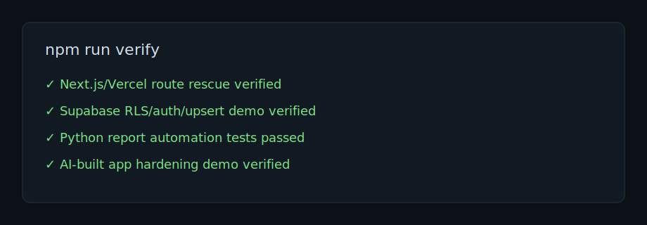

# AI App Rescue Case Studies

This repository contains public demo case studies that mirror common failures in AI-built or fast-moving small software projects.

These are demo artifacts, not client work. They contain no private data, secrets, customer systems, or paid API keys.

## Offer

I fix one broken Next.js, Vercel, Supabase, API, or automation issue and leave you with a working patch plus a short technical handover.

## Case Studies



| Case study | Problem | Proof |
|---|---|---|
| [Next.js / Vercel Route Rescue](case-studies/nextjs-vercel-route-rescue/README.md) | API route appears implemented but returns `404` | Broken app, fixed app, local endpoint verification |
| [Supabase RLS / Auth / Upsert Fix](case-studies/supabase-rls-auth-upsert-fix/README.md) | UI action appears successful but data write is blocked or mis-owned | Policy/session simulator, before/after SQL, assertions |
| [Python Report Automation](case-studies/python-report-automation/README.md) | Manual file/API reporting creates slow and inconsistent output | Sample inputs, tested script, generated summary |
| [AI-built App Hardening](case-studies/ai-built-app-hardening/README.md) | Generated app fails at import/build time because runtime assumptions are unsafe | Before/after route module and verification script |

## Verification

Run every case study check:

```bash
npm install
npm run verify
```

Run one lane:

```bash
npm run verify:next
npm run verify:supabase
npm run verify:python
npm run verify:ai
```

## Delivery Pattern

Every case study follows the same structure:

```text
Failure -> Diagnosis -> Fix -> Verification -> Handover
```

The goal is not to show a polished app. The goal is to show how a small broken system is diagnosed, fixed, verified, and handed over without unrelated rewrites.

## Proposal Snippet

```text
I work best on small, concrete failures in existing apps. Here is a public demo of my delivery style: failure, diagnosis, minimal fix, verification, and handover. I can use the same process for one broken route, Supabase write, API issue, or automation script in your repo.
```

## Scope

Good fit:

- one broken route, webhook, deploy path, auth flow, data write, or automation script
- existing repo or minimal reproduction
- clear expected behavior and current error
- a fix that can be reviewed as a small patch

Not a fit:

- full app rebuilds disguised as bug fixes
- private production data before a funded contract
- secrets sent through chat
- vague "make this app work" requests without reproduction steps

## Publish Status

This repo is prepared locally. It has not been pushed or published yet.
